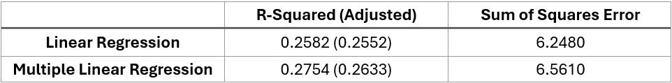
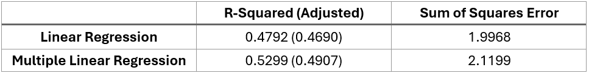

# Factors Influencing Goal Contributions in Football

## Overview

In highest level of football, small details can change the outcome of the match. One of the most important aspects of football is scoring goals, which often involves assists. Understanding the factors related to these actions can help improve tactics and increase the chances of winning. 
This project aims to analyze the impact of different factors on goal contributions. The process involves using data from public sources and transforming it into an appropriate format. Explanatory Data Analysis (EDA) was preformed to gain a better understanding of the data. Linear Regression was used to estimate the relationship between each factor and goal contributions. The finding can provide insights to improve tactics in football matches.

## Data

This project uses data from [UEFA Euro 2020 dataset provided by Mikhail Zhilkin](https://data.world/cervus/uefa-euro-2020). The details of each dataset are as follows:

- [Match player statistics](https://data.world/cervus/uefa-euro-2020/workspace/file?filename=Match+player+statistics.csv): This dataset includes individual statistics for each player in every match of UEFA Euro 2020. It contain variables such as the home team, away team, player name, played time, and nearly 200 metrics related to player performance.
- [Match line-ups](https://data.world/cervus/uefa-euro-2020/workspace/file?filename=Match+line-ups.csv): The dataset provides line ups for each team in every match of UEFA Euro 2020. It includes variables such as home team, away team, player name, player role, jersey number, etc.

_Note: to access the dataset, you need to create account on the [data.world](https://data.world/) website. Otherwise the page will show "Page not found"._

## Instructions

This project was done using R script, which run on Rstudio. The analysis is divided into two parts for easier interpretation. Both scripts include data cleaning and joining processes. The details are as follows:

- Exploratory Data Analysis - The script [eda.R](./code/eda.R) located in the `code` folder is used to explore the data and gain a better understanding of it.
- Analysis using Machine Learning Model - The script [analysis.R](./code/analysis.R) located in the `code` folder is used to build a Linear Regression model.

Both scripts are organized into main sections and subsections. The length of the hash symbols indicates the different levels of topics:

- Main Section: denoted by the longest hash symbols on both sides of the section name (##########################)
- Subsection: denoted by shorter hash symbols (#########)
- Details of Each Command: denoted by a single hash symbol (#)

To replicate the results, you can follow these steps:
1. Download the R scripts ([eda.R](./code/eda.R) and [analysis.R](./code/analysis.R)) given above and import into Rstudio.
2. Download the dataset in [Data](#Data) and replace the path in "import data" section of the script.
3. If you run the first few lines of code and get an error, it might be because the required library is not installed. For example, if you need "dplyr", use install.packages("dplyr") to install the package.
4. Run the code in the order from top to bottom.

## Results

Over 200 player statistics were reviewed and selected based on previous studies and how close it related to goal scoring. Each feature was visualized to see its relationship with goals and assists. A summary of relationships between variables is shown in the correlation matrix and the table below:

From the result, we selected only features with a correlation coefficient greater than 0.2. We assumed that correlation lower than 0.2 do not indicate a clear relationship and unlikely to affect prediction accuracy. As a result, 5 features were selected. 

Among these features, total attempts and attempt accuracy were closely related. We excluded the variable with the lower correlation coefficient to prevent overfitting. In this case, attempt accuracy was not included in Multiple Linear Regression model. 
Another key insight is that the same factor in different areas of the pitch contributes differently to goal contribution. It can be seen that penalty area has stronger relationship with goal contributions compared to other areas of the pitch.

In the analysis, we compared the performance of using only one feature with the highest correlation coefficient versus using multiple features. Both models capture only 26 percent of the overall variation. This low R-Squared value suggests that the quality of data should be investigated further.

We aim to modify the dataset to make the model to better capture the variation. In previous model training, all midfielders and forwards were included in the analysis. Since some midfielders are instructed to prioritize defense, they rarely have contribution to goal scoring. We used K-Means Clustering to separate the types of midfielders. Factors related to attacking and defending were selected to distinguish the type of midfielders. The elbow method was used to find the optimal number of clusters, which is two. The results clearly shows that cluster 1 has lower values in attacking metrics and higher values in defending metrics. Additionally, the results show that the majority of defensive players have no goal contributions. Therefore, we excluded players in cluster 1 and players with no goal contributions from the analysis and rebuilt the model.

The improved dataset was used to build the regression model again. Both models capture nearly 50 percent of the overall variance. We assess the model performance by using adjusted R-squared, which gives a fairer comparison between the Linear Regression and Multiple Linear Regression models. Therefore, Multiple Linear Regression was better fitting the data and captures more variance than Linear Regression.

From the model training, the results confirms that total attempts have the highest influence on goal contributions. Time spent in the attacking third, which has a correlation coefficient of 0.2, has no influence on goal contributions. It can be assumed that order of actions might matter. Total attempts might have the closet relationship because it is the action before scoring goals, whereas solo run into the penalty area is the action before scoring attempts and therefore have a lower influence than total attempts.
